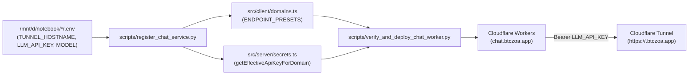
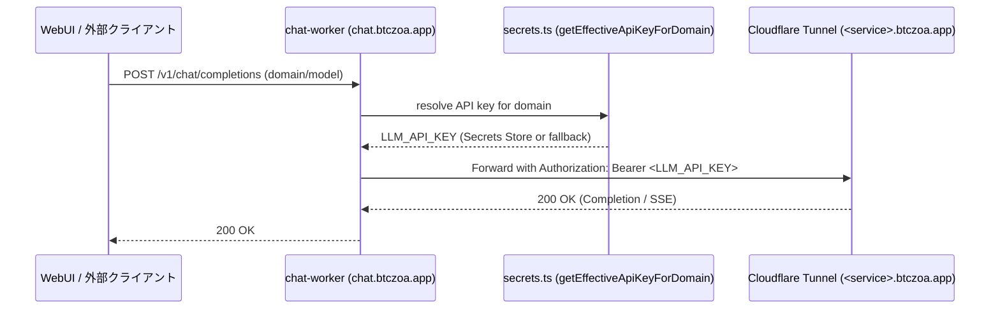

# Architecture (`chat-worker-service-register`)

## 1. 論理構成図 (Logical Flow)

```mermaid
flowchart LR
    NB["/mnt/d/notebook/*/.env<br/>(TUNNEL_HOSTNAME, LLM_API_KEY, MODEL)"] --> REG["scripts/register_chat_service.py"]
    REG --> DOM["src/client/domains.ts<br/>(ENDPOINT_PRESETS)"]
    REG --> SEC["src/server/secrets.ts<br/>(getEffectiveApiKeyForDomain)"]
    DOM --> VER["scripts/verify_and_deploy_chat_worker.py"]
    SEC --> VER
    VER --> CF["Cloudflare Workers<br/>(chat.btczoa.app)"]
    CF -->|Bearer LLM_API_KEY| UP["Cloudflare Tunnel<br/>(https://<service>.btczoa.app)"]
```

## 2. 認証・プロキシシーケンス (Sequence Diagram)

```mermaid
sequenceDiagram
    participant Client as WebUI / 外部クライアント
    participant Worker as chat-worker (chat.btczoa.app)
    participant Secrets as secrets.ts (getEffectiveApiKeyForDomain)
    participant Tunnel as Cloudflare Tunnel (<service>.btczoa.app)

    Client->>Worker: POST /v1/chat/completions (domain/model)
    Worker->>Secrets: resolve API key for domain
    Secrets-->>Worker: LLM_API_KEY (Secrets Store or fallback)
    Worker->>Tunnel: Forward with Authorization: Bearer <LLM_API_KEY>
    Tunnel-->>Worker: 200 OK (Completion / SSE)
    Worker-->>Client: 200 OK
```
