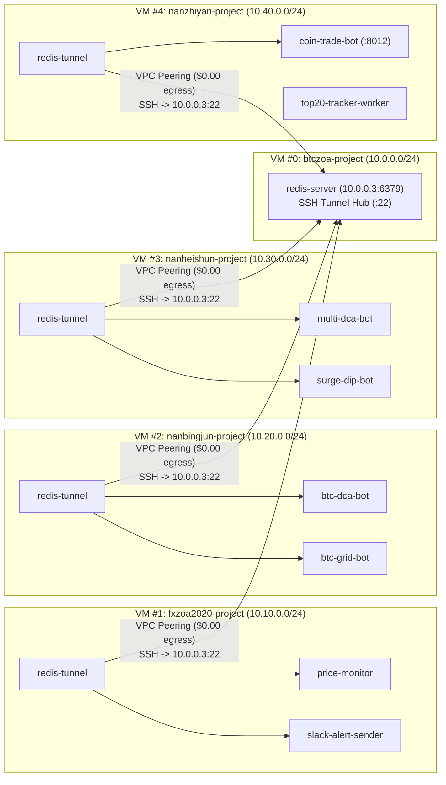
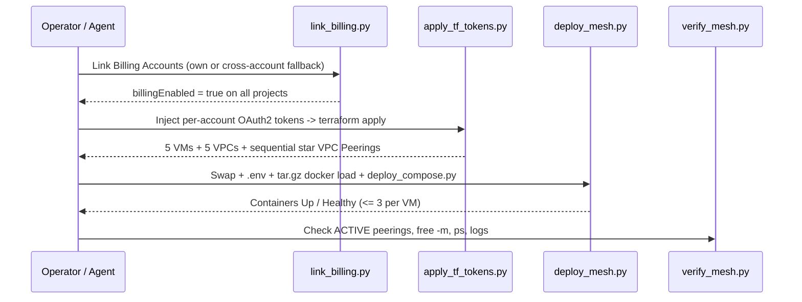

# Architecture (`gcp-free-tier-mesh`)

## 1. Logical & Physical Star-Topology Mesh (`us-central1-a`)

```mermaid
flowchart LR
  subgraph VM0["VM #0: btczoa-project (10.0.0.0/24)"]
    REDIS["redis-server (10.0.0.3:6379)\nSSH Tunnel Hub (:22)"]
  end

  subgraph VM1["VM #1: fxzoa2020-project (10.10.0.0/24)"]
    T1["redis-tunnel"] --> PM["price-monitor"]
    T1 --> SA["slack-alert-sender"]
  end

  subgraph VM2["VM #2: nanbingjun-project (10.20.0.0/24)"]
    T2["redis-tunnel"] --> DCA["btc-dca-bot"]
    T2 --> GRID["btc-grid-bot"]
  end

  subgraph VM3["VM #3: nanheishun-project (10.30.0.0/24)"]
    T3["redis-tunnel"] --> MDCA["multi-dca-bot"]
    T3 --> SDIP["surge-dip-bot"]
  end

  subgraph VM4["VM #4: nanzhiyan-project (10.40.0.0/24)"]
    T4["redis-tunnel"] --> CTB["coin-trade-bot (:8012)"]
    W4["top20-tracker-worker"]
  end

  T1 -->|"VPC Peering ($0.00 egress)\nSSH -> 10.0.0.3:22"| REDIS
  T2 -->|"VPC Peering ($0.00 egress)\nSSH -> 10.0.0.3:22"| REDIS
  T3 -->|"VPC Peering ($0.00 egress)\nSSH -> 10.0.0.3:22"| REDIS
  T4 -->|"VPC Peering ($0.00 egress)\nSSH -> 10.0.0.3:22"| REDIS
```

## 2. Cross-Project Provisioning Sequence

```mermaid
sequenceDiagram
  participant Op as Operator / Agent
  participant Billing as link_billing.py
  participant TF as apply_tf_tokens.py
  participant Deploy as deploy_mesh.py
  participant Verify as verify_mesh.py

  Op->>Billing: Link Billing Accounts (own or cross-account fallback)
  Billing-->>Op: billingEnabled = true on all projects
  Op->>TF: Inject per-account OAuth2 tokens -> terraform apply
  TF-->>Op: 5 VMs + 5 VPCs + sequential star VPC Peerings
  Op->>Deploy: Swap + .env + tar.gz docker load + deploy_compose.py
  Deploy-->>Op: Containers Up / Healthy (<= 3 per VM)
  Op->>Verify: Check ACTIVE peerings, free -m, ps, logs
```
